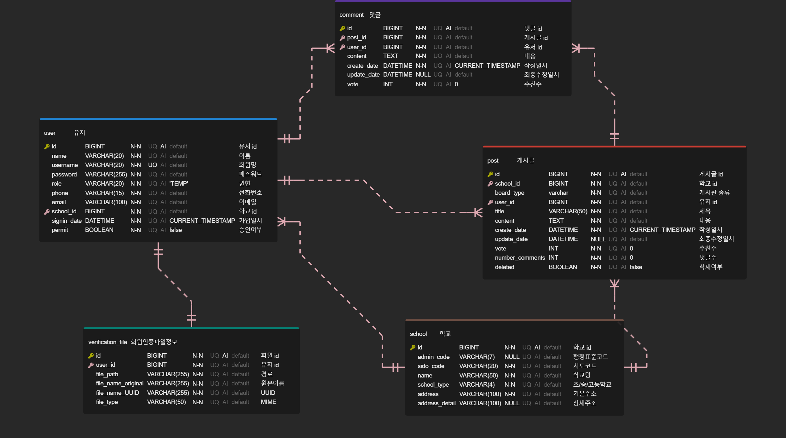

# 🗒 우리학교 게시판(고등학생 커뮤니티)
재학생 또는 졸업생이 이용할 수 있는 고등학교 커뮤니티

## 프로젝트 기능 및 설계
- 회원가입 기능
  - 사용자는 회원가입 신청을 할 수 있으며, 모든 사용자는 회원가입 신청시 즉시 'TEMP' 권한(임시 사용자)을 지닌다. 
  - 회원가입을 제외한 서비스의 모든 기능을 사용하려면, 관리자의 승인을 거쳐 'USER' 권한(이하 일반 사용자)을 획득해야한다.

  - 가입 신청시 아이디와 패스워드를 입력받으며, 아이디는 unique 해야한다.
  - 회원으로부터 가입신청 시 입력받는 정보는 다음과 같다.
    - 이름
    - 회원명
    - 패스워드
    - 전화번호
    - 이메일
    - 고등학교명
    - 학생 인증 정보(학생증 또는 졸업증명서)
  - 학교 정보는 '나이스 교육정보 개방 포털 OPEN API'를 활용해서 가입 시 학교명을 입력하면 해당 단어가 포함된 학교 리스트를 나열하여 제공한다.
  - 학생 인증 수단은 학생증 또는 졸업증명서를 사진찍어 첨부하여 요청하고, 관리자의 검토 후 가입 승인/거절된다.
  - 학생 인증 정보가 유효하면, 관리자의 승인 이후 'USER' 권한으로 변동된다.
  - 학생 인증 정보가 유효하지 않으면 가입 거절되며, 회원가입 정보는 삭제된다.

- 로그인 기능
  - 사용자는 로그인을 할 수 있다. 로그인시 회원가입때 사용한 아이디와 패스워드가 일치해야한다.

- 'USER'(일반사용자) 회원 기능  
  - 게시판은 모든 '일반 사용자'가 함께 사용할 수 있는 '모두의 게시판'과 '모두의 익명게시판', 
    그리고 같은 고등학교 학생끼리만 사용할 수 있는 '우리학교 게시판'과 '우리학교 익명게시판' 으로 구분된다. 

  - 게시글 작성 기능
    - 일반 사용자는 게시글 제목(텍스트), 게시글 내용(텍스트)를 작성할 수 있다.

  - 게시글 목록 조회 기능
    - 게시글은 최신순으로 기본 정렬되며, 추천 순으로도 정렬이 가능하다.
    - 게시글 목록 조회시 응답에는 게시글 제목과 작성일, 댓글 수의 정보가 필요하다.
    - 게시글은 많을수 있으므로 paging 처리를 한다. 

  - 특정 게시글 조회 기능
    - 게시글 제목, 게시글 내용, 작성일로 게시글을 조회할 수 있다. 
    - 익명 게시판이 아닌 일반 게시판은 작성자로 조회가 가능하다.

- 댓글 작성 기능
  - 일반 사용자는 댓글 내용(텍스트)를 작성할 수 있다.

- 댓글 목록 조회 기능
  - 특정 게시글 조회시 댓글목록도 함께 조회가 된다. 다만 댓글은 많을 수 있기 때문에 별도의 API로 구성한다.
  - 댓글은 최신순으로만 정렬되며, paging 처리를 한다. 
  - 댓글 목록 조회시에는 댓글 작성자와 댓글 내용, 댓글 작성일의 정보가 필요하다.

  - 급식 식단 조회 기능
    - 사용자 학교의 당월 급식 식단 정보를 조회할 수 있다.

## ERD 

## Trouble Shooting
[go to the trouble shooting section](doc/TROUBLE_SHOOTING.md)

### Tech Stack
   
   
   
   
   
  

